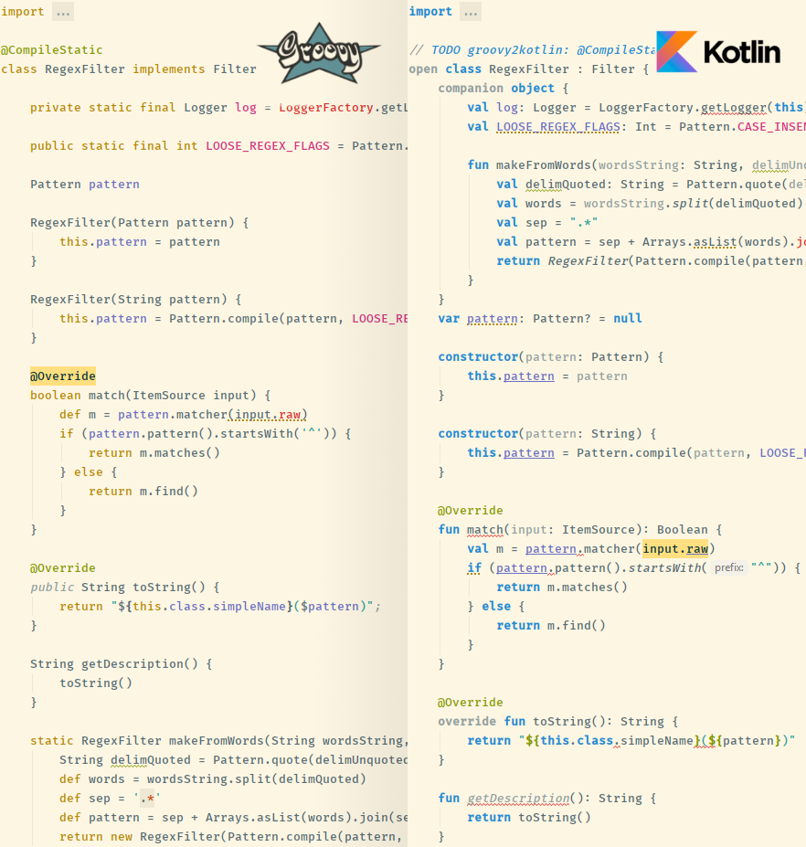

# groovy2kotlin

An utility converting [Groovy](http://groovy-lang.org/) sources to [Kotlin](https://kotlinlang.org/) language.

The result of translation *isn't 100%* Kotlin-correct usually and user is required to review the result,
but a significant amount of work can be saved for free.

Started Nov 2019 by [zencd](https://github.com/zencd) in order to convert a project of mine
because I've not found any existing tools (and it's easy to write one by myself).
The current implementation is simple: it uses Groovy's internal
libs to parse source text into a well designed AST, then the tree is traversed and
translated to Kotlin. Type inference is performed.

Feel free to submit a bug, ticket and do all the github things.

| Covered  | Covered
|----------|------------- 
| ✔ Control structures | ✔ Expressions
| ✔ Classes            | ✔ Bitwise expressions
| ✔ Closures           | ✔ Static members grouped within companion
| ✔ Groovy's implicit imports | ✔ Groovy's standard functions (WIP)

## Requirements

- JDK 1.8 (for running the tool)
- Groovy 2.5.8 (for running the tool)
- Kotlin 1.3 (produced code level)

Others may be supported but was not tested.

## Usage

[See here](USAGE.md)

## Structure

- `Gtk.toKotlinAsSingleString()` - converts a Groovy script text into Kotlin
- `BulkProcessor` - converts a directory recursively
- `GroovyToKotlin` - the translator engine
- `test-data/input-output-tests/` - a set of input/output tests showing how the things gets translated

## Example

## Todo 1

- Kotlin prohibits implicit casts like `Int -> Long`
- Wildcard expressions: `list*.prop = 123`
- Presence of both field `some` and `getSome()` is not respected by Kotlin (but it's ok in Groovy)
- If there are both field `some` and `getSome()` in Groovy code, the method should be preferred (like Groovy does)
- Operator `input =~ regex` -> `regex.toRegex().matchEntire(input)`
- Groovy scripts (statements outside any classes)
- Allow annotations for everything
- Do import static things like this: `import pack.Classe.Companion.staticMethod`
- Preserve javadoc (there is a way)
- Replace use/import of anno `groovy.transform.CompileStatic` with Kotlin's analog
- Probably translate `def` → `Any` in formal params, not `Object`
- Groovy allows implicit conversions like `String s = 1L`
- Groovy comparison operator `<=>`
- static inner classes can't be translated with modifier `static`
- `List` mapping:
    - `eachWithIndex` → `forEachIndexed` (params swapped!)
    - `grep` → `?`
- `File` mapping:
    - `size()` → `length()`
    - `File.text`
- `String` mapping:
    - `length()` → `length` attr
    - `String.execute()`
- `Number` mapping:
    - `intValue()` → `.toInt()` etc
- Optional:
    - `Deprecated` -> `@kotlin.Deprecated(message)`
    - Add `const` to `val FLAGS: Int = 11`
- Add tests:
    - `list << item`
    - `String.toByteArray`
    - `File.size()`
    - `@Override` not translated
    - `File.getText`
    - `const val`
    - `List.size() -> size`
    - `List.every() -> all`

## Todo 2

- Check a field is never rewritten thru code, and mark it as `val` then
- Groovy's special use of bitwise operators on lists, streams, etc
- Translate Groovy's implicit `return` (solved for certain cases)
- Implement "Groovy truth" behaviour for:
    - String, GString
    - List and Map ancestors
    - Object
- Kotlin's `open` and `override` (a common, type-aware algorithm)

## Some history

✔ Classes ✔ Interfaces
✔ Anonymous classes 
✔ Inner classes ✔ Nested classes
✔ Inheritance
✔ Annotations
✔ Range expression
✔ In-string expressions
✔ Bitwise expressions
✔ Operator `in`
✔ Operator `==~`
✔ Operator `is`
✔ Arrays
✔ Local vars
✔ Multiple value assignment
✔ `/.+/` regexps
✔ `if`
✔ `while`
✔ `for(;;)`
✔ `break` ✔ `continue`
✔ loop labels
✔ `throws`
✔ `String.replaceAll()`
✔ `equals()`
✔ `hashCode()`
✔ `toString()`
✔ `String.join` → `joinToString` 
✔ `Some.class`

## Progress on a project

	2019-11-10 - 4734 Kotlin errors
	2019-11-12 - 848
	2019-11-13 - 691
    2019-11-15 - 714
    2019-11-16 - 619
    2019-11-17 - 526
